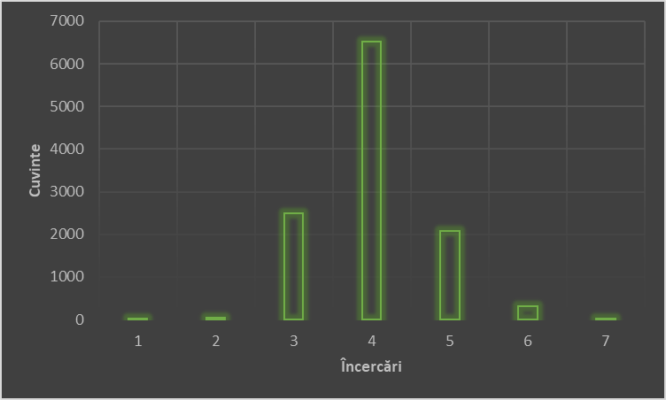

# Proiect `Wordle`
Echipa formată din:

-**Popa Sebastian** (grupa 151)

-**Apostol Alin-Constantin** (grupa 151)

## Descriere
Jocul *„Wordle”* a devenit popular pe **Twitter** la sfârșitul lui decembrie 2021, datorită simplității acestuia precum și unui feature de partajare adăugat de **Josh Wardle** (creatorul jocului), care permite utilizatorilor să-și copieze rezultatele sub forma unei grile de emoji pătrate colorate.

Cum se joacă? Scopul este să ghicești un cuvânt din 5 litere din cât mai puține încercări, numărul maxim fiind 6. O dată introdus un cuvânt valid, primești anumite indicii:

1. Dacă o literă din cuvântul introdus nu apare în cuvântul de ghicit, va fi colorată cu  `gri`.

2. Dacă o literă din cuvântul introdus apare în răspuns, dar nu pe acea poziție, va fi colorată cu  `galben`.

3. Dacă o literă din cuvântul introdus apare în răspuns și pe poziția corespunzătoare, va fi colorată cu  `verde`.

Exemplu:

Astfel, aplicația pe care am creat-o dispune de mai multe opțiuni, precum: alegerea dificultății (3/6/12/∞ încercări admise), resetarea jocului, dar și un buton de `ajutor` care oferă jucătorului cel mai bun răspuns posibil având în vedere încercările anterioare. Acest cuvânt este determinat folosind entropia lui Shannon.

## Statistici
* sunt 11454 de cuvinte valide ce pot fi răspunsuri

* numărul mediu de încercări per cuvânt obținut este `4,0151` (dacă se folosește doar *helper-ul*)

## Extra
* cel mai bun răspuns de început (*opener*) este `TAREI`
* `_stats.txt` (`solutii.txt`) se obține rulând `get_stats.cpp` și descrie secvența de răspunsuri date de *helper* pentru fiecare răspuns posibil
* `precomputed.txt` se obține rulând `get_precomputed.cpp` și conține al doilea răspuns al *helper-ului* dacă primul răspuns a fost `TAREI`
## Prerequisites
* compile `main.cpp` to `main.exe`
* run `GAME.py` and have fun

### for `linux` only, in the `tools.py` file 
*    comment line `36` (ctypes.windll ... )
*    comment line `47` (root.iconbitmap('ico.ico'))

## Referințe:
* [https://en.wikipedia.org/wiki/Wordle](https://en.wikipedia.org/wiki/Wordle)
* [https://www.theguardian.com/games/2021/dec/23/what-is-wordle-the-new-viral-word-game-delighting-the-internet](https://www.theguardian.com/games/2021/dec/23/what-is-wordle-the-new-viral-word-game-delighting-the-internet)
* [https://www.nytimes.com/games/wordle/index.html](https://www.nytimes.com/games/wordle/index.html)
* [https://www.youtube.com/watch?v=v68zYyaEmEA](https://www.youtube.com/watch?v=v68zYyaEmEA)
* [https://www.pythontutorial.net/tkinter/](https://www.pythontutorial.net/tkinter/)
* [https://www.markdownguide.org/getting-started/](https://www.markdownguide.org/getting-started/)